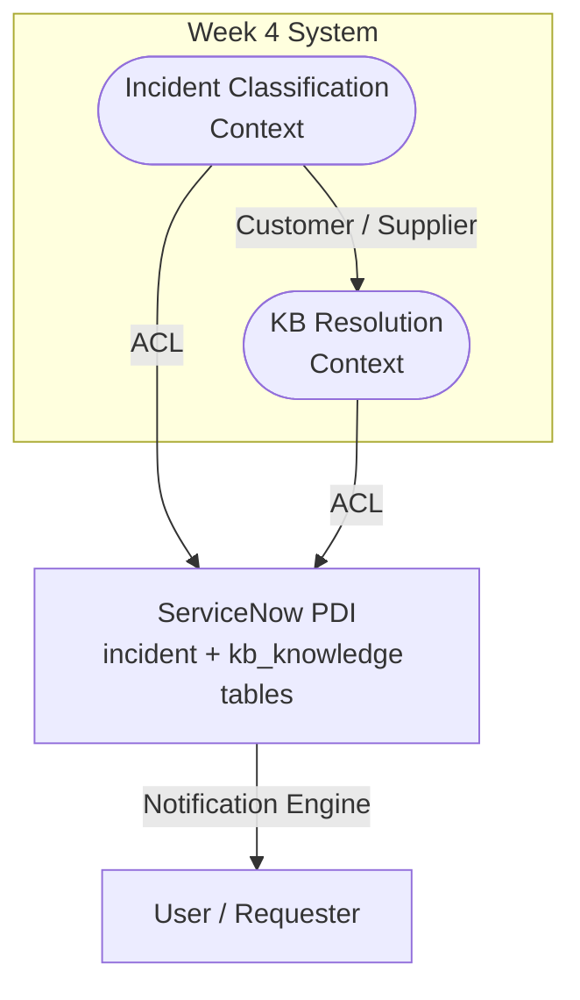

# Python Learning — Progress

## Project Goal
ServiceNow Incident Classifier: fetch incidents from PDI → Claude AI triage → via MCP (no API credits needed)

## Phases
| Phase | Goal | Status |
|---|---|---|
| 1 | Python fundamentals via the classifier script | Done |
| 2 | Fetch real incidents from ServiceNow PDI | Done |
| 3 | MCP setup — Claude Code as the AI brain | Done |
| 4 | End-to-end pipeline: real incidents → classify → KB match → update ServiceNow | **Design Grill in progress** |

---

## Completed Work

### Week 2 — `week2_servicenow_fetcher.py`
- Auth: OAuth 2.0 (token from `/oauth_token.do`, then Bearer header)
- User: `svc_python_integration` with `itil` role (also tested with `admin`)
- Credentials: loaded from `.env` via `python-dotenv`
- Test incident: INC0009005 — confirmed working
- ServiceNow OAuth app: `python_oauth_client`, no scope restriction, Table API access confirmed

### Week 3 — `week3_ticket_classifier.py`
- 20 sample tickets classified with: category, subcategory, priority, impact, confidence, reasoning
- System prompt: ITSM expert at a banking company, ITIL v4, uses urgency × impact matrix
- `DEMO_MODE = True` (no API key needed) — mock data returns realistic classifications
- Impact field added: High / Medium / Low, based on number of users affected × business criticality
- Output saved to `ticket_classifications.json`
- Run with: `python3 week3_ticket_classifier.py`

---

## Week 4 — Design Grill Session (In Progress)

**Session started:** 2026-04-29
**Skill used:** design-grill (Martin's Clean Architecture + Evans' DDD, 8 phases)
**Resume at:** Phase 4

---

### Phase 1: What Is This, Really? ✅

**Finding:** Classification is a *Supporting Subdomain*, not the Core Domain.

The **Core Domain** is **incident resolution automation** — the full chain from "ticket raised" to "user self-served or system auto-resolved."

Classification is the trigger that starts that chain. The real measure of success is:
- P1 (Critical) incidents → 0
- P3/P4 (Medium/Low) → resolved via self-serve KB articles without L1 analyst involvement
- Human in the loop = verifier/auditor, not the primary actor

If classification were done on a spreadsheet, it wouldn't break anything today — but it can't drive the automation chain. That's why it needs to be designed as **step 1 of a resolution pipeline**, not a standalone classifier.

---

### Phase 2: The Language of the Domain ✅

**Ubiquitous Language (locked):**

| Term | Definition |
|---|---|
| **Incident** | An unplanned IT disruption with category, subcategory, priority, impact, and state. "Ticket" and "incident" are the same — "incident" is the canonical term. |
| **Classification** | Assigning category + subcategory + priority + impact to a new incident |
| **Resolution** | The documented fix on a closed incident — short description + resolution notes |
| **Knowledge Article (KB)** | A pre-written solution in ServiceNow's `kb_knowledge` table |
| **Best Match** | KB article surfaced by comparing a new incident's description against resolved incidents' resolutions — two paths: direct link if one exists on a resolved incident, scan of `kb_knowledge` table if not |
| **Self-Serve** | User resolves their own incident via KB article without L1 analyst involvement |
| **Awaiting Customer Update** | Incident state after KB article is dispatched — waiting for user response |
| **SLA Condition** | The 3-day rule: no customer response → incident auto-closed |
| **Customer Response** | The signal that confirms whether the KB resolved the issue |

---

### Phase 3: Drawing the Map ✅

**Confirmed Context Map:**



**Key decisions:**
- Two internal Bounded Contexts: **Incident Classification** (upstream) and **KB Resolution** (downstream)
- Both talk to ServiceNow through an **ACL** — translates between domain model and raw ServiceNow fields (`sys_id`, `sysparm_query`, etc.)
- KB article dispatch → incident state set to *Awaiting Customer Update* → ServiceNow's own notification engine emails the user
- The **3-day SLA auto-close lives inside ServiceNow natively** (scheduled job or Flow Designer) — NOT in the Python code. Week 4 only sets the state; ServiceNow enforces the timer.
- KB matching: if resolved incident has a linked KB article → use it. If not → scan `kb_knowledge` table by matching on short_description + resolution notes.

**Map confirmed by user — Phase 3 complete.**

---

## Resume Checklist for Next Session

Pick up at **Phase 4: Who Does What?**

Questions to ask:
- What is each component's single reason to change?
- Does classification logic and KB matching logic live in the same class/module? (They shouldn't — different actors drive change for each)
- What is the blast radius if the KB matching logic changes?

Then continue through:
- **Phase 5:** Dependency direction — does domain logic import ServiceNow infrastructure?
- **Phase 6:** Aggregate boundaries — what invariants must hold? (e.g. an incident cannot be in "Awaiting Customer Update" without a KB article attached)
- **Phase 7:** Flow test — walk an incident end to end from creation to self-serve close
- **Phase 8:** Agent opportunities — where should automation run without a human?

---

## .env Structure
```
SNOW_INSTANCE=https://dev390733.service-now.com
SNOW_USER=admin
SNOW_PASS=<password>
SNOW_CLIENT_ID=<client_id>
SNOW_CLIENT_SECRET=<client_secret>

# MCP server variable names (same values)
SERVICENOW_INSTANCE_URL=https://dev390733.service-now.com
SERVICENOW_USERNAME=admin
SERVICENOW_PASSWORD=<password>
SERVICENOW_CLIENT_ID=<client_id>
SERVICENOW_CLIENT_SECRET=<client_secret>
SERVICENOW_AUTH_TYPE=oauth
```
